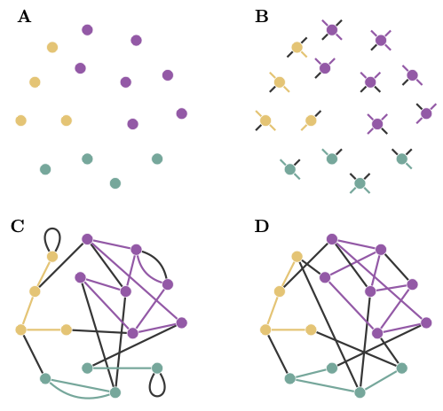

How it works
============

The Artificial Benchmark for Community Detection (ABCD) is a method
for sampling a random graph with known ground truth community
structure. This page will detail the algorithm implemented in this
package for sampling an ABCD graph. It's not exactly the same as the
algorithm proposed in Kamiński, Prałat, and Théberge (2021) and includes
parts of Kamiński et. al (2022).

The Big Picture
---------------

An ABCD graph is a union of many community graphs and a global
background graph. Generating an ABCD graph follows a five step
process.

1. Assign nodes to communities

2. Assign degrees to nodes and split degrees

4. Generate community (and background) graphs

5. Merge Graphs

Each node has its degree split between its community graph and the global background
graph, with the $\xi$ (xi) proportion going to the background (subject to random rounding).

The Configuration Model
-----------------------

The Configuration Model (Bollobás, 1980) is a classic algorithm for
generating a multi-graph with a specified degrees sequence, and will
serve as a corner stone for the ABCD model. The input to the configuration
model is a degree sequence $d_1, d_2, \dots d_n$. It creates $n$ nodes,
and each node $n_i$ is given $d_i$ half-edges (or edge stubs). Then, the
half edges are paired randomly to create full edges. Since half-edges may
be paired with other half-edges from the same node (creating loops), or
there may be duplicate pairs (parallel edges), this algorithm creates
a multi-graph.

Rewiring
--------

However, we typically want a simple graph without loops and parallel edges.
To preseve the degree sequence, we can perform a series of rewirings to try
and fix the bad (loops and parallel) edges the multi-graph. This is accomplished
by iteratively selecting a bad edge, $uv$, and another edge at random, $xy$. We
consider rewiring these edges into either $ux, vy$ or $uy, vx$ (chosen randomly)
and accept the change if it does not create any new bad edges. This process is not
guaranteed to terminate, there may not exist a simple graph with the specified degree
sequence, so we typically only try to rewire each bad edge some maximum number of times.

The Full Algorithm
------------------

========= ===================== ==================================================
Parameter Range                 Description
--------- --------------------- --------------------------------------------------
$n$       $\mathbb{N}$          Number of Nodes
$\xi$     $[0,1]$               Level of noise
--------- --------------------- --------------------------------------------------
$\gamma$  $(2,3)$ (recommended) Exponent for power-law degree distribution
$\delta$  $[1, n-1]$            Minimum degree
$\Delta$  $[\delta, n-1]$       Max degree
--------- --------------------- --------------------------------------------------
$\beta$   $(1,2)$ (recommended) Exponent for power-law community size distribution
$s$       $[\delta, n]$         Minimum community size
$S$       $[s, n]$              Maximum community size
========= ===================== ==================================================

1. Assign Nodes to Communities

    Sample a sequence of community sizes $s_1, s_2, \dots s_{\ell}$ from a discrete power-law
    distribution (minimum s, maximum S, exponent $\beta$) such that the sum is at least $n$.
    Let $a = \left( \sum_{i \in 1 ... \ell} s_i \right) - n$. If $s_\ell \geq a + s$, the decrease
    $s_\ell$ by $a$. Otherwise, delete $s_\ell$ and increase $a$ random $s_i$ by $1$.

    This step can be overridden by passing a community size sequence directly.

2. Assign Degrees to Nodes

    Sample a degree sequence by taking $n$ i.i.d samples from a power-law distribution
    with minimum $\delta$, maximum $\Delta$, and exponent $\gamma$. Like the previous step,
    this can be overridden by passing a degree sequence directly.

    When assigning degrees, we need to make sure that we can generate a simple community
    graph from the result. In particular, if node $i$ is in a community with size $c_i$,
    and it got assigned a degree $d_i > \lceil \xi (c_i-1) \rceil$, then it would have more
    community degree than other nodes in it's community. A further problem could be caused
    by edges from the background graph that fall within the community. The specific derivation
    is a bit technical (see the paper for details), but we only allow node $i$ to be assigned
    degree $d$ if
    $$d \leq \frac{c_i - 1}{1 - \xi \phi},$$
    where
    $$\phi = \sum_{j \in 1 .. \ell} \left( \frac{s_j}{n} \right)^2.$$
    We sample a random admissible assignment by assigning degrees in decreasing order, and assigning
    each degree to a random admissible node. If no nodes are admissible, we assign to the node with
    the largest bound.

    Finally, the degree $d_i$ of each node $i$ is split into a community degree $x_i$ and a background
    degree $y_i$, where $y = \xi d_i$, rounded to an int such that $\xi d_i$ is the expected value, and
    $x = d_i - y$. If the sum of community degrees for any community is odd then one of the maximal
    community degrees (of that community) is decreased by 1 (and that node's background degree is
    increased by 1).

3. Generate Community (and Background) Graphs

    This step samples, possibly in parallel, each of the community graphs and the global background
    graph. Each graph is also individually rewired to remove loops and parallel edges.

4. Merge

    Finally, we merge all the graphs generated in the previous step and run a final rewiring to fix
    and collisions caused by a community and background edge.

References
----------

- Béla Bollobás. A probabilistic proof of an asymptotic formula for the number of labelled regular graphs. European Journal of Combinatorics, 1(4):311-316, 1980.
- `Bogumił Kamiński, Paweł Prałat, and François Théberge. Artificial Benchmark for Community Detection (ABCD)—Fast random graph model with community structure. Network Science 9(2):153-178 (2021) doi: 10.1017/nws.2020.45 <https://doi.org/10.1017/nws.2020.45>`_
- `Bogumił Kamiński, Tomasz Olczak, Bartosz Pankratz, Paweł Prałat, and François Théberge. Properties and Performance of the ABCDe Random Graph Model with Community Structure. Big Data Research 30:100348 (2022) doi: 10.1016/j.bdr.2022.100348 <https://doi.org/10.1016/j.bdr.2022.100348>`_
